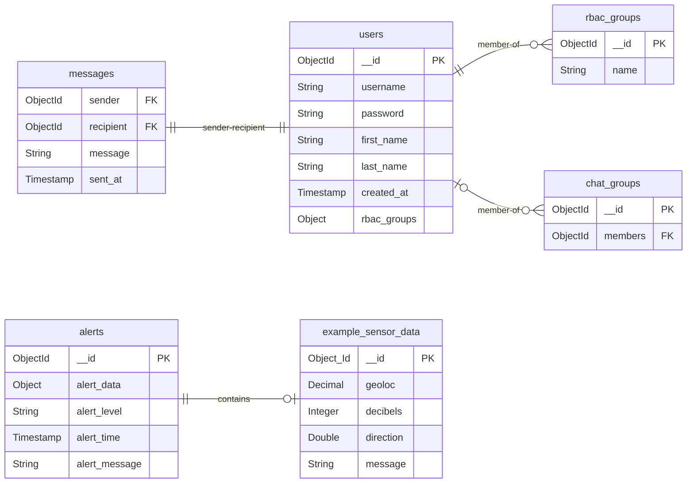

# Backend code for the Black Relay Web App.



## Prerequisites
- Node
- Docker

## Usage
1. Clone this repo and cd into the root directory:

```
git clone https://github.com/joshrnoll/mqtt-to-mongodb.git && cd mqtt-to-mongodb
```

2. Run the 'prod' docker compose:

```
cd docker-compose/prod && docker compose up -d
```

3. Check that the server is running on port 3001 by going to ```http://localhost:3001``` in your browser

4. Subscribe to the test topic by going to ```http://localhost:3001/subscribe/testtopic``` in your browser. You should receive the following JSON response:

```JSON
{
  "status": "success",
  "message": "Successfully subscribed to topic testtopic"
}
```

5. Exec into the MongoDB shell

```
docker exec -it mongodb mongosh -u admin -p password
```

6. Connect to the database

```mongosh
test> use mqtt-to-mongodb
```

7. Check that the collection was created. (It will be the topic name + an 's' since MongoDB attempts to pluralize collection names)

```mongosh
mqtt-to-mongodb> show collections
testtopics
```

8. Check that data is being pushed into the collection:

```
db.testtopics.find()
```

You should see the following output:

```mongosh
  {
    _id: ObjectId('68bffe85c5b911c6f7458799'),
    title: 'Sensor Data',
    message: 'Data from a device',
    __v: 0
  },
  {
    _id: ObjectId('68bffe8fc5b911c6f745879b'),
    title: 'Sensor Data',
    message: 'Data from a device',
    __v: 0
  },
  {
    _id: ObjectId('68bffe99c5b911c6f745879d'),
    title: 'Sensor Data',
    message: 'Data from a device',
    __v: 0
  }
```

## Cleanup

Ensure you are in the ```docker-compose/prod``` directory and run:

```
docker compose down --rmi local
```

This will stop and remove all three containers and remove the locally built express image from your system.