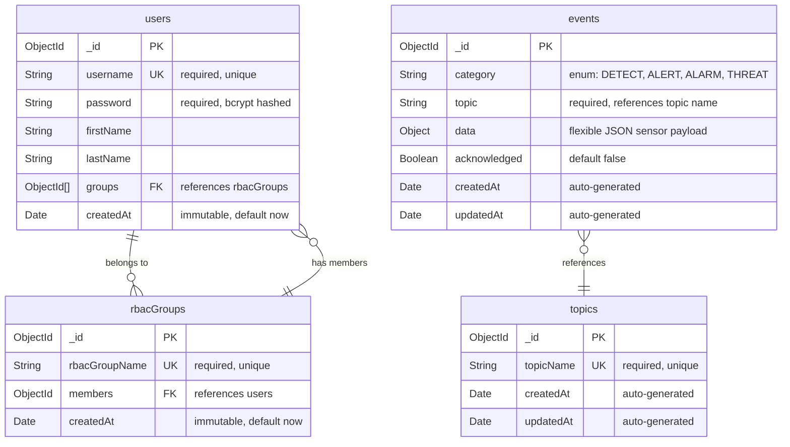

# Backend code for the Black Relay Web App.


## Generating Swagger Docs

```
npx swagger-cli bundle swagger/swagger.yaml --outfile ./swagger.yaml --type yaml
```

## ERD



**Schema Details:**

- **users**: User accounts for platform access. Linked to rbacGroups for role-based permissions (admin/analyst).
- **rbacGroups**: Role definitions (e.g., admin, analyst). Controls access levels and permissions.
- **events**: Sensor event data received via MQTT. Category indicates escalation level. Data field contains flexible sensor-specific JSON payload.
- **topics**: MQTT topic registry. Backend subscribes to topics and automatically stores incoming messages as events.
