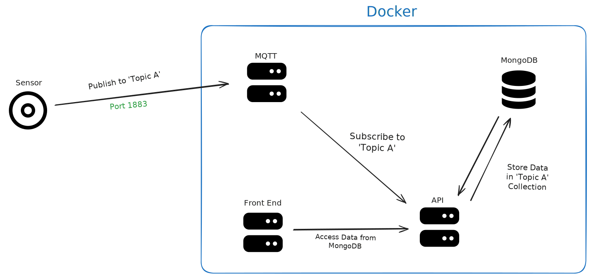
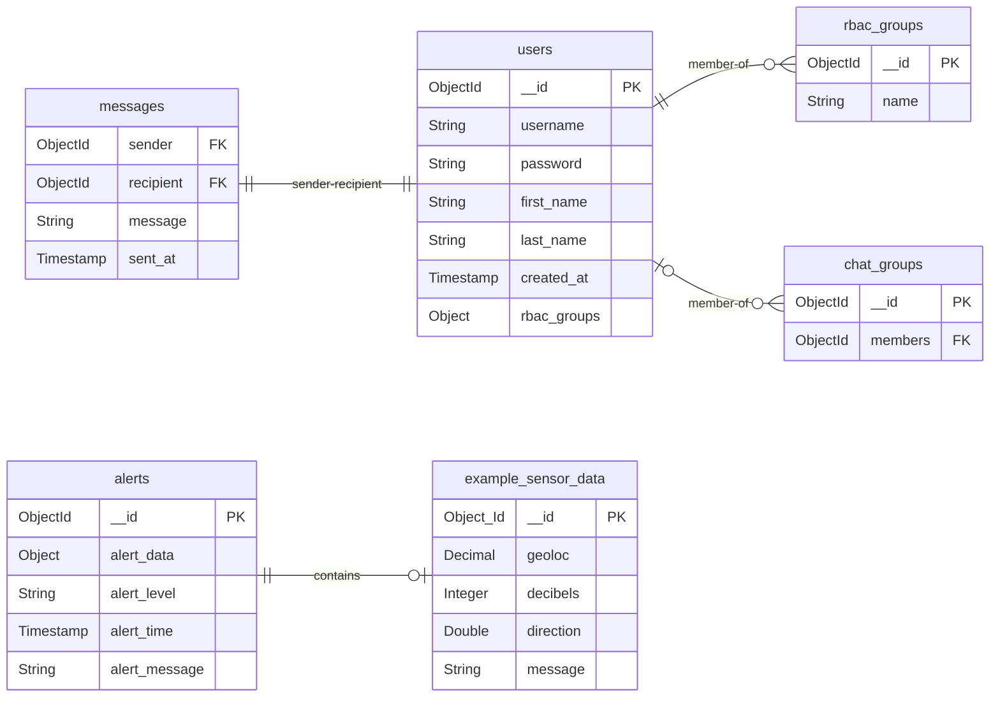

# Backend code for the Black Relay Web App.



## Building a Dev Environment
See [DEVELOPMENT.md](../docs/DEVELOPMENT.md)

## Generating Swagger Docs
```
npx swagger-cli bundle swagger/swagger.yaml --outfile ./swagger.yaml --type yaml
```

## ERD
