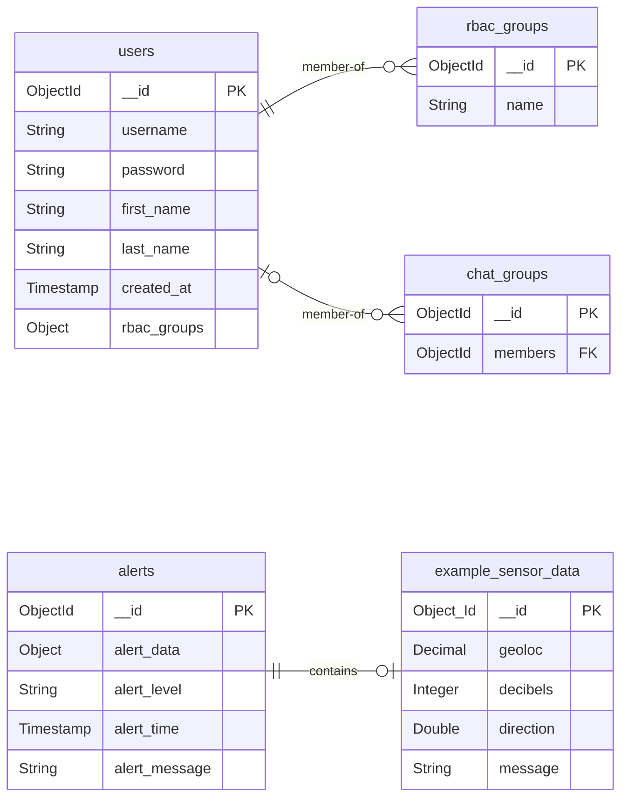

# Backend code for the Black Relay Web App.


## Generating Swagger Docs
```
npx swagger-cli bundle swagger/swagger.yaml --outfile ./swagger.yaml --type yaml
```

## ERD
> ***NOTE:*** NEEDS UPDATE

```mermaid
erDiagram
direction LR
users{
  ObjectId __id PK
  String username
  String password
  String first_name
  String last_name
  Timestamp created_at
  Object rbac_groups
}
chat_groups{
  ObjectId __id PK
  ObjectId members FK
}
rbac_groups{
  ObjectId __id PK
  String name
}
alerts{
  ObjectId __id PK
  Object alert_data
  String alert_level
  Timestamp alert_time
  String alert_message
}
example_sensor_data{
  Object_Id __id PK
  Decimal geoloc
  Integer decibels
  Double direction
  String message
}
users ||--o{ rbac_groups : member-of
users |o--o{ chat_groups : member-of
alerts ||--o| example_sensor_data : contains
```